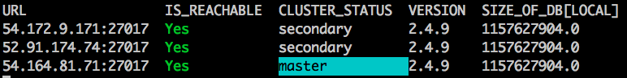

Mongo Admin
============

This is a top-like tool for showing continuously-updated attributes of a set of MongoDB instances that might be relevant to administration.

Here are the command line options:

    Usage: ./mongo_admin.rb [options] instance_1_url instance_2_url instance_3_url...
        -d, --db db                      Database to inspect for size/existence
        -s, --refresh_seconds SECONDS    Number of seconds to sleep before refresh

Here is what it looks like pointed at a 3-node replica set:

Listed attributes currently include reachability, cluster status, mongodb
version, and the size of whichever database is selected by the user on
invocation.

Future directions could include:

* Source the instance URLs directly from AWS
* Use status attributes to filter a list of instance URLs and invoke an administrative command. For example:
    * Run knife bootstrap on new, unreachable mongo instances
    * Modify cluster status using our connection via the ruby mongo driver, or via knife ssh.

As a side note, the cookbooks I used for running mongodb on my Ubuntu EC2 instances are the following:

* apt 2.9.2
* build-essential 2.2.4
* mongodb 0.16.3
* python 1.4.6
* yum 3.8.2
* yum-epel 0.6.5

The yum and yum-epel cookbooks are needed to satisfy the mongodb cookbook's dependencies, even though they aren't used.

